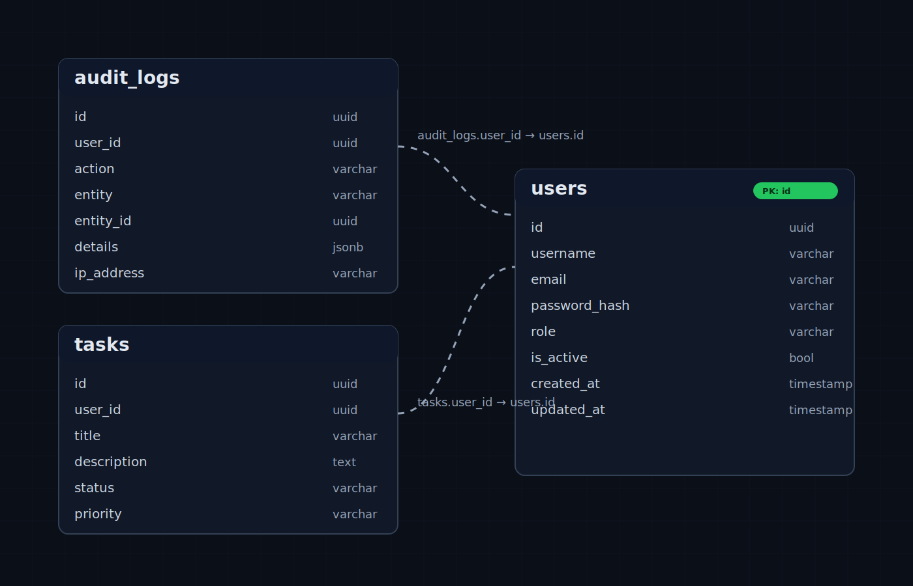

Frontend URL: https://backend-development-internship-task.vercel.app/tasks
Backend API Docs URL: https://backend-development-internship-task.onrender.com/api-docs/

# Full-Stack Auth + RBAC Task Manager

This repository contains a backend API and a frontend app with:
- JWT authentication with refresh flow
- Role-based access control (user/admin)
- Task CRUD operations
- Admin-only dashboard endpoint
- React Router protected routes in frontend

## Workspace Layout

- backend: Express API, PostgreSQL schema, Swagger docs, Postman collection, Docker compose
- frontend: React + Vite app with auth, tasks, and admin dashboard UI

## Tech Stack

Backend:
- Node.js
- Express
- PostgreSQL via pg
- JWT via jsonwebtoken
- Password hashing via bcrypt
- Validation via joi
- Security middleware: helmet, cors, cookie-parser
- Request logging via morgan
- API docs via swagger-jsdoc + swagger-ui-express

Frontend:
- React
- Vite
- React Router
- Tailwind CSS
- Fetch API

## Backend Features

Authentication:
- POST /api/v1/auth/register
- POST /api/v1/auth/login
- POST /api/v1/auth/refresh
- POST /api/v1/auth/logout
- GET /api/v1/auth/me

Notes:
- Access token is set as an httpOnly cookie with path /api/v1
- Refresh token is set as an httpOnly cookie with path /api/v1/auth
- Auth middleware accepts both Bearer token and accessToken cookie

Role-based access:
- Middleware authorize(...roles) enforces user role
- Admin route protected by authenticate + authorize('admin')
- GET /api/v1/admin/dashboard

Task CRUD (authenticated):
- GET /api/v1/tasks
- GET /api/v1/tasks/:id
- POST /api/v1/tasks
- PUT /api/v1/tasks/:id
- DELETE /api/v1/tasks/:id

Validation:
- Joi schemas for register, login, create task, update task
- Unknown request fields are stripped in validation middleware

API docs:
- Swagger UI: /api-docs
- Postman collection: Postman_Collection.json

## Frontend Features

Routing and route protection:
- /auth for login/register
- /tasks for authenticated users
- /admin for admin users only
- ProtectedRoute redirects unauthenticated users to /auth
- ProtectedRoute with requireRole="admin" blocks non-admin users from /admin

UI flows:
- Register and login forms
- Session bootstrap via /auth/me then /auth/refresh fallback
- Task create/edit/delete/list with status filter
- Admin dashboard loads stats from /api/v1/admin/dashboard
- API error/success messages displayed in auth/tasks/admin pages

## Database Schema



Schema file:
- src/models/database-initialization.sql

Tables:
- users
- tasks
- audit_logs

Highlights:
- UUID primary keys
- Foreign key from tasks.user_id to users.id
- Role and status checks via SQL constraints
- Indexes for common lookup fields

## Local Setup

Prerequisites:
- Node.js 18+
- PostgreSQL 12+

1. Start PostgreSQL and create database:

```bash
createdb auth_db
```

2. Initialize schema:

```bash
psql -d auth_db -f src/models/database-initialization.sql
```

3. Configure backend environment:

Create backend/.env with values like:

```env
PORT=5000
NODE_ENV=development
FRONTEND_URL=http://localhost:5173

DB_HOST=localhost
DB_PORT=5432
DB_NAME=auth_db
DB_USER=postgres
DB_PASSWORD=password

JWT_SECRET=change_me
JWT_EXPIRES_IN=15m
REFRESH_TOKEN_SECRET=change_me_too
REFRESH_TOKEN_EXPIRES_IN=14d
BCRYPT_ROUNDS=10
```

4. Run backend:

```bash
npm install
npm run dev
```

5. Run frontend in another terminal:

```bash
cd ../frontend
npm install
npm run dev
```

6. Open frontend and docs:
- Frontend: http://localhost:5173
- Backend: http://localhost:5000
- Swagger: http://localhost:5000/api-docs

## Example Login Credentials

Use these credentials to test login flows in development:

User account:
- Email: shyamnkolge@gmail.com
- Password: Shyam@123

Admin account:
- Email: admin@gmail.com
- Password: Admin@123

## Docker

From backend directory:

```bash
docker compose up --build
```

Services:
- postgres: 5432
- backend: 5000
- frontend: 3000

Compose file uses:
- schema mount from ./src/models/database-initialization.sql
- frontend build context ../frontend
- frontend API env var VITE_API_URL

## Scripts

Backend (backend/package.json):
- npm run dev
- npm start

Frontend (frontend/package.json):
- npm run dev
- npm run build
- npm run preview

## Scalability Notes

Current architecture is modular and ready to grow by:
- Splitting domains into additional route/controller modules
- Adding Redis caching for heavy read paths
- Adding centralized structured logging and log aggregation
- Running multiple backend instances behind a load balancer

See SCALABILITY.md for detailed expansion paths.
